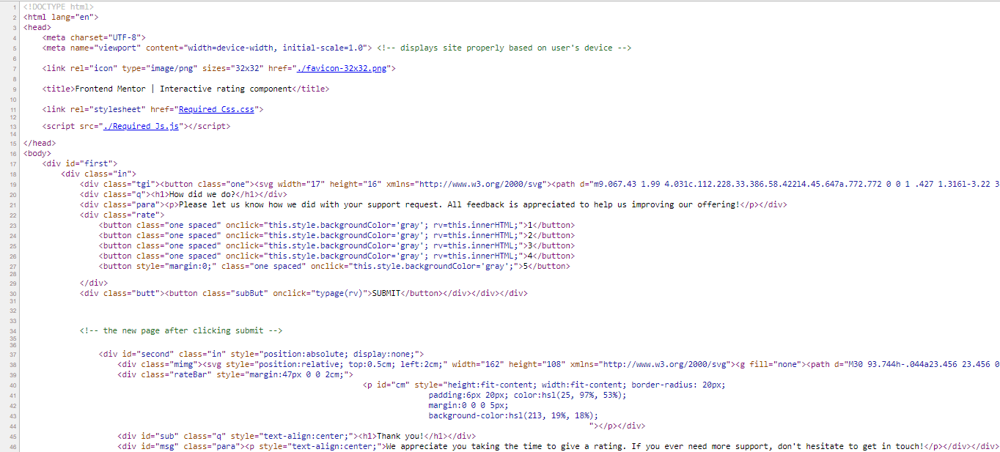

# Frontend Mentor - Interactive rating component solution

This is a solution to the [Interactive rating component challenge on Frontend Mentor](https://www.frontendmentor.io/challenges/interactive-rating-component-koxpeBUmI). Frontend Mentor challenges help you improve your coding skills by building realistic projects. 

## Table of contents

- [Overview](#overview)
  - [The challenge](#the-challenge)
  - [Screenshot](#screenshot)
  - [Links](#links)
- [My process](#my-process)
  - [Built with](#built-with)
  - [What I learned](#what-i-learned)
  - [Continued development](#continued-development)
  

## Overview

### The challenge

Users should be able to:

- View the optimal layout for the app depending on their device's screen size
- See hover states for all interactive elements on the page
- Select and submit a number rating
- See the "Thank you" card state after submitting a rating

### Screenshot



### Links

- Solution URL: [Add solution URL here](https://www.frontendmentor.io/solutions/desktopview-solution-with-custom-msg-display-and-hover-js-css-and-html-ZgMd_V3UZ-)
- Live Site URL: [Add live site URL here](https://prankisster.github.io/FSDev/interactiveRatingChallange/Index.html)

## My process

### Built with

- Semantic HTML5 markup
- Css
- JavaScript
- [Styled Components](https://fonts.google.com/specimen/Overpass) - For styles


### What I learned

    Here I would like to highlight the insights I gained while working on this project.

- To begin with I would say I learnt the importance of observation, to replicate the things are.
- <mark>Things are not how they seem to be.</mark> Through trial and error, of the various methods that were popping in my mind to show page transition (as it would seem). 
- To make changes to and as pointer hovers over certain elements.
- Making custom, user input based changes to pages.
- Also got to learn what svg (Scalable Vector Graphics) are.

```css

/* This is how one can give round shape to elements */

.one
{
    border-radius:50%;
    padding:11px;
    height:1.15cm;
    width:1.15cm;
    background-color:hsl(213, 19%, 18%);
}
       

/* This is how changes in appearance should be made when the user hovers over certain elemnts (Example: SUBMIT button) */

.subBut:hover
        {
            background-color:white;
            color:hsl(25, 97%, 53%);
            cursor:pointer;
        }

```

```js

/* This the Java script code I wrote to make changes to page as user clicks */
function typage(val)
{
    mes="You selected " +val+ " out of 5";
    document.getElementById('cm').innerHTML=mes;
    document.getElementById('first').style.display="none";
    document.getElementById('second').style.display="block";
}

```


### Continued development

    I would love to explore and to fully exploit the usage of js. Cause I found it intriguing.
